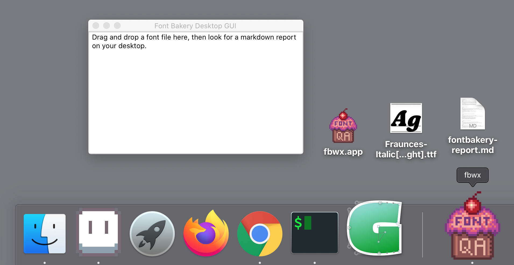

# fbwx

Work in progress. A simple drag 'n' drop GUI frontend for [Font Bakery](https://github.com/googlefonts/fontbakery/). Made with just two [requierments](requierments.txt), [wxPython](https://pypi.org/project/wxPython/) and [FontBakery](https://pypi.org/project/fontbakery/).

Note: I don't know how to do a subprocess call that makes this work in the built `.app`, but it works when run from a terminal/venv.



## Run the GUI from a virtual environment (works!)
From the root of the fbwx repo:
```
python3 -m venv venv
source venv/bin/activate
pip install -r requirements.txt
python3 fbwx.py
```

## Build a MacOS app (almost works!)
With the virtual environment from the previous section active:
```
pip install py2app
python3 setup.py py2app
```
Find `fbwx.app` in the dist directory`fbwx/dist/fbwx.app`. Move it to your Desktop or Applications directories.
